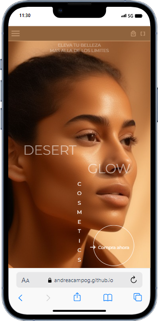
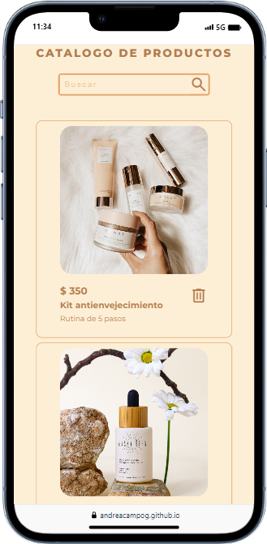
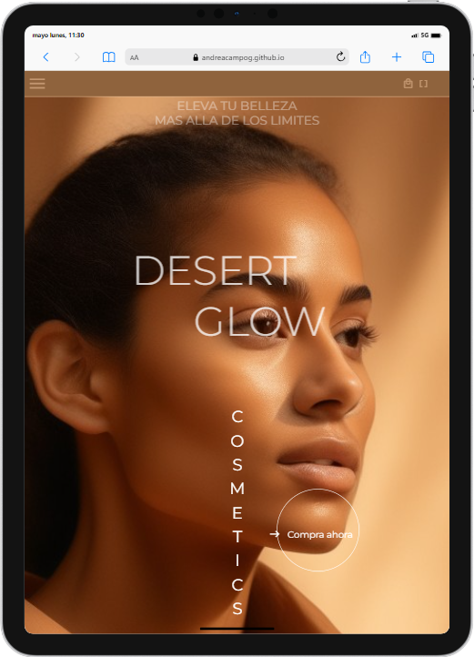
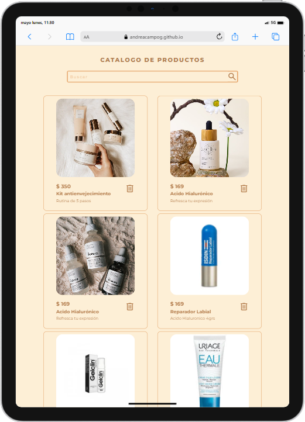
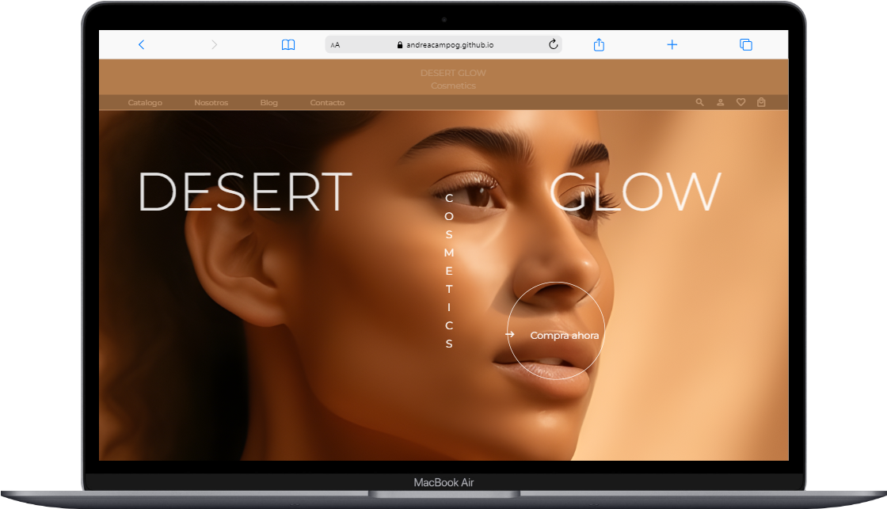
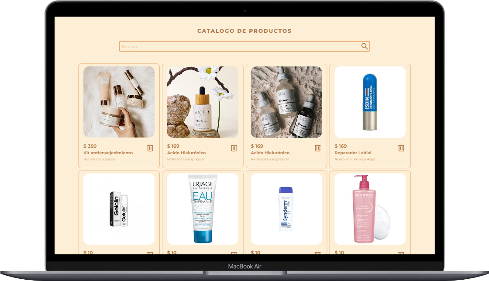

Desarrollo de página de productos de belleza con operaciones CRUD usando json-server .

## Tecnologias utilizadas durante el curso
* Javascript
* NodeJS
* Json-server

## Tecnologias utilizadas en el proyecto
* HTML
* CSS
* JavaScript
* NodeJS
* Json-server

## Screenshots

  

  

  

  

  

  

  

## Si usas el proyecto y las busquedas no te funcionan:

* En el terminal: npm install -g json-server@latest

* En el archivo package.json : modifica la version de "json-server": "^0.16.3"

* En el terminal: npm install
